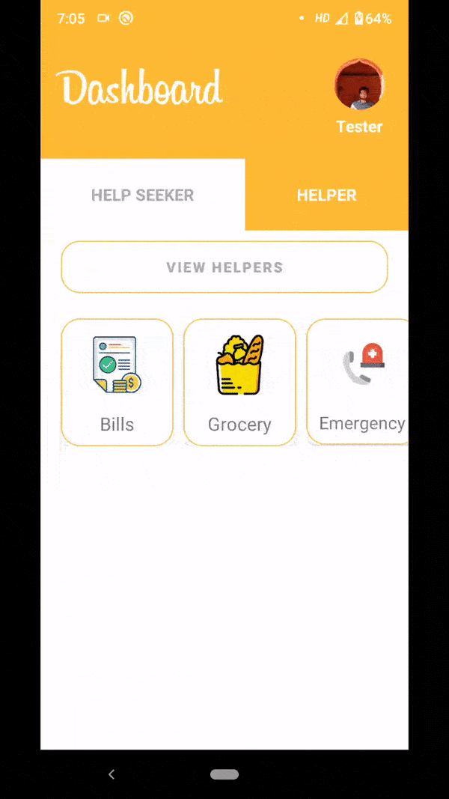

# Sahay - सहाय - A Way to Give Back
A platform for youngsters to voluntarily help disabled people and senior citizens during tough times.


## Overview
Most Senior citizens and physically challenged people are stuck at home due to the pandemic. A large fraction of them are stuck alone at home, making it difficult for them to get by. Our App aims to make their lives easier by providing a means for them to seek help from volunteers for tasks like 
* Buying and delivering essentials and medicines
* Domestic assistance
* An accident or emergency at home, considering the fact that emergency services in our country are super slow to respond.


### WorkFlow of our Application :
- A user logs in or registers through the app using email or Facebook
- When the user chooses to request help, he'll have to specify the kind of help he wants to avail, with some essential details. 
- After posting the request, the app automatically uploads the location of the user, which the volunteers will have access to. 
- We are using Google's firebase service for storing user data, and we have integrated google maps for easy navigation.

### Tech Stack

- Java For Android
- Google Maps API
- Facebook API for User Authentication
- Cloud Firestore
- Directions API
- Google ML-Kit

## Simple and Intuitive UI

We’ve ensured ease of use by using
descriptive icons and large color-coded buttons, which makes navigating through the app a whole lot easier for the target users. The gifs illustrate some of the functionalities of our application.

  

 
### Steps for Using
1. Clone the repo
  ```
  git clone 'https://github.com/Mainakdeb/sahay.git'
  ```
2. Open Android Studio or download it
  ```
  https://developer.android.com/studio
  ```
3. Firebase usage(Make sure these lines are there in app module of build.gradle file)
  ```
  implementation 'com.google.firebase:firebase-ml-vision:24.0.3'
  implementation 'com.google.firebase:firebase-ml-vision-face-model:20.0.1'
  ```
4. Facebook SDK(Make sure these lines are there in app module of build.gradle file)
  ```
  implementation 'com.facebook.android:facebook-android-sdk:[5,6)'
  implementation 'com.facebook.android:facebook-share:[5,6)'
  ```

### Firebase by Google ###
- Using Firebase for saving details was very easy and it was awesome. Here's a snippet
 ```
  HashMap<String, Object> hashMap = new HashMap<>();
                                hashMap.put("email",email);

                                firestore.collection("Users").document(currentUserID).set(hashMap).addOnCompleteListener(new OnCompleteListener<Void>() {
                                    @Override
                                    public void onComplete(@NonNull Task<Void> task) {
                                        if (task.isSuccessful())
                                        {
                                            progressDialog.dismiss();
                                            Intent setupIntent = new Intent(LoginActivity.this, SetupActivity.class);
                                            setupIntent.putExtra("email",email);
                                            setupIntent.addFlags(Intent.FLAG_ACTIVITY_NEW_TASK | Intent.FLAG_ACTIVITY_CLEAR_TASK);
                                            startActivity(setupIntent);
                                        }
                                        else
                                        {
                                            progressDialog.dismiss();
                                            String err = task.getException().getMessage();
                                            Toast.makeText(LoginActivity.this, err, Toast.LENGTH_SHORT).show();
                                        }
                                    }
                                });
 ```
- We also used Firebase's ML-Kit to verify if the user is uploading a correct image as that ensures safety of the person being helped.

 ```
  private void verifyImage(){


          FirebaseVisionFaceDetectorOptions highAccuracyOpts =
                  new FirebaseVisionFaceDetectorOptions.Builder()
                          .setPerformanceMode(FirebaseVisionFaceDetectorOptions.ACCURATE)
                          .setLandmarkMode(FirebaseVisionFaceDetectorOptions.ALL_LANDMARKS)
                          .setClassificationMode(FirebaseVisionFaceDetectorOptions.ALL_CLASSIFICATIONS)
                          .build();
          ProfileImageView.setDrawingCacheEnabled(true);
          Bitmap bitmap = Bitmap.createBitmap(ProfileImageView.getDrawingCache());
          FirebaseVisionImage image = FirebaseVisionImage.fromBitmap(bitmap);
          ProfileImageView.setDrawingCacheEnabled(false);
          FirebaseVisionFaceDetector detector = FirebaseVision.getInstance()
                  .getVisionFaceDetector(highAccuracyOpts);
          Task<List<FirebaseVisionFace>> result =
                  detector.detectInImage(image)
                          .addOnSuccessListener(
                                  new OnSuccessListener<List<FirebaseVisionFace>>() {
                                      @Override
                                      public void onSuccess(List<FirebaseVisionFace> faces) {
                                          // Task completed successfully
                                          // ...
                                          Log.d("MainActivity","Faces detected:"+ Integer.toString(faces.size()));
                                          if(faces.size()==0){
                                              //Toast.makeText(SetupActivity.this,"Please insert a proper image",Toast.LENGTH_SHORT).show();
                                              new AlertDialog.Builder(SetupActivity.this)
                                                      .setTitle("Face Recognition")
                                                      .setMessage("Please insert a proper image")
                                                      .setPositiveButton("OK", null)
                                                      .show();
                                          }
                                          else if(faces.size()==1){

                                              up_photo.setVisibility(View.INVISIBLE);
                                              uploadImage();

                                          }
                                      }
                                  })
                          .addOnFailureListener(
                                  new OnFailureListener() {
                                      @Override
                                      public void onFailure(@NonNull Exception e) {
                                          // Task failed with an exception
                                          // ...
                                      }
                                  });


      }
 ```


### Facebook API ###

  Facebook API was mainly used for the register part and we saved users into firebase
  ```
  private void handleFacebookAccessToken(AccessToken token) {

        AuthCredential credential = FacebookAuthProvider.getCredential(token.getToken());
        mAuth.signInWithCredential(credential)
                .addOnCompleteListener(this, new OnCompleteListener<AuthResult>() {
                    @Override
                    public void onComplete(@NonNull Task<AuthResult> task) {
                        if (task.isSuccessful()) {
                            // Sign in success, update UI with the signed-in user's information
                            FirebaseUser user = mAuth.getCurrentUser();
                        } else {
                            // If sign in fails, display a message to the user.

                        }

                        // ...
                    }
                });
    }
 ```


